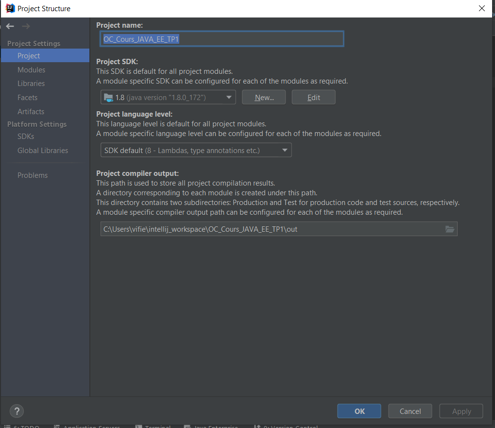
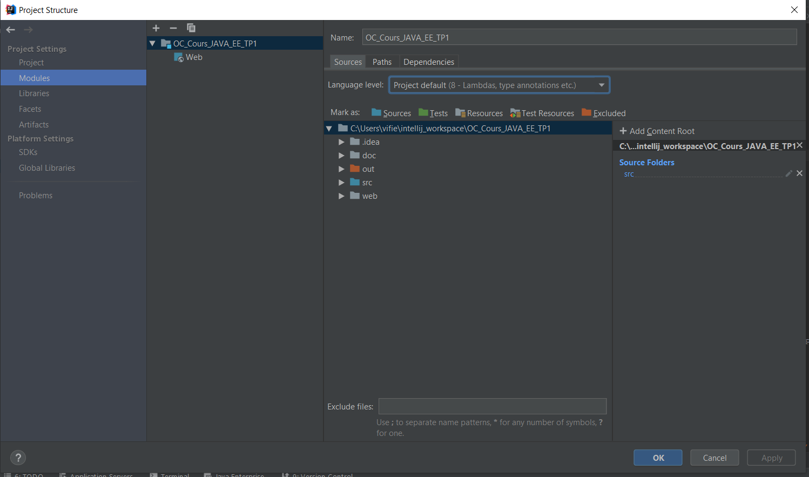
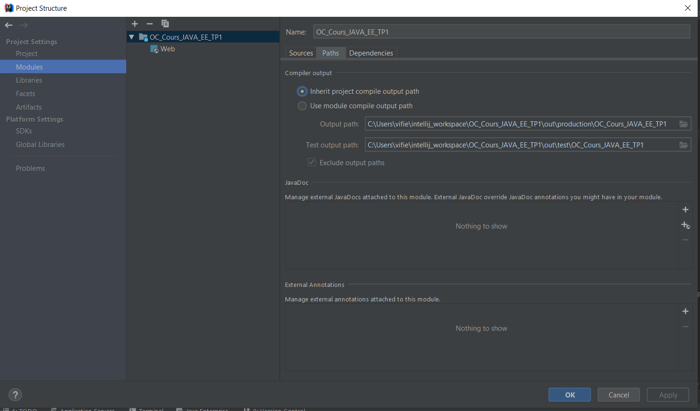
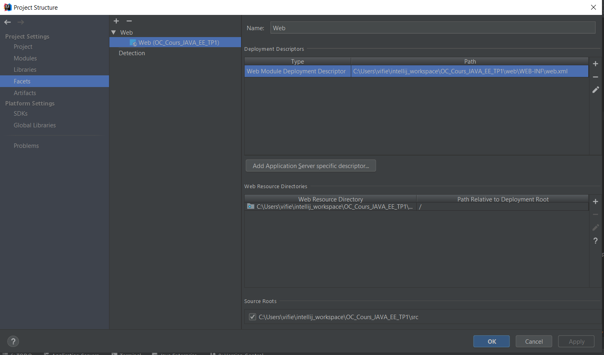
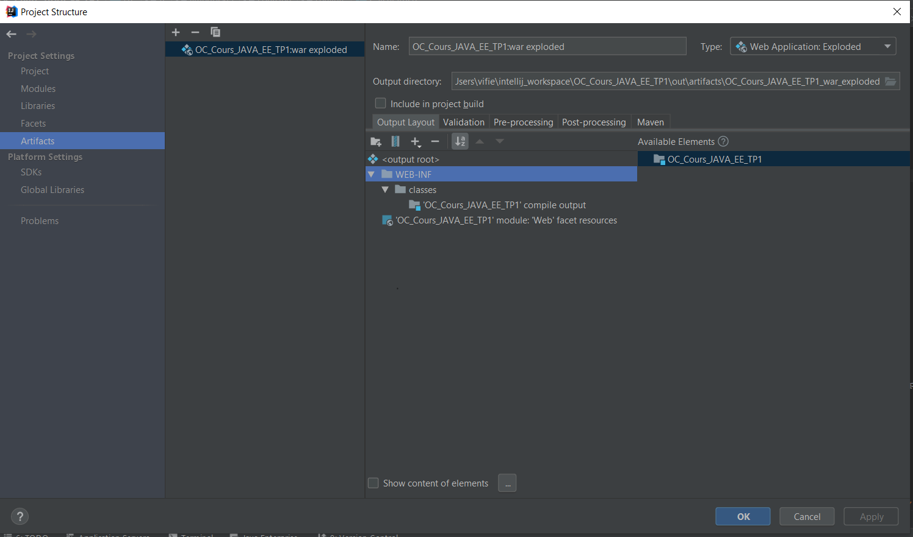
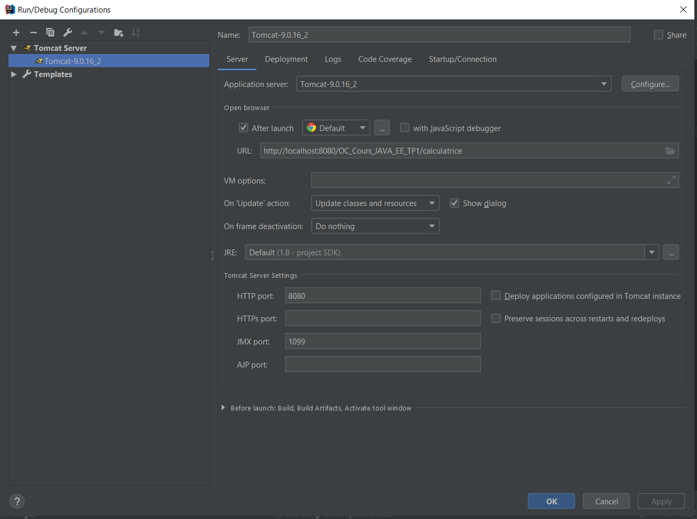
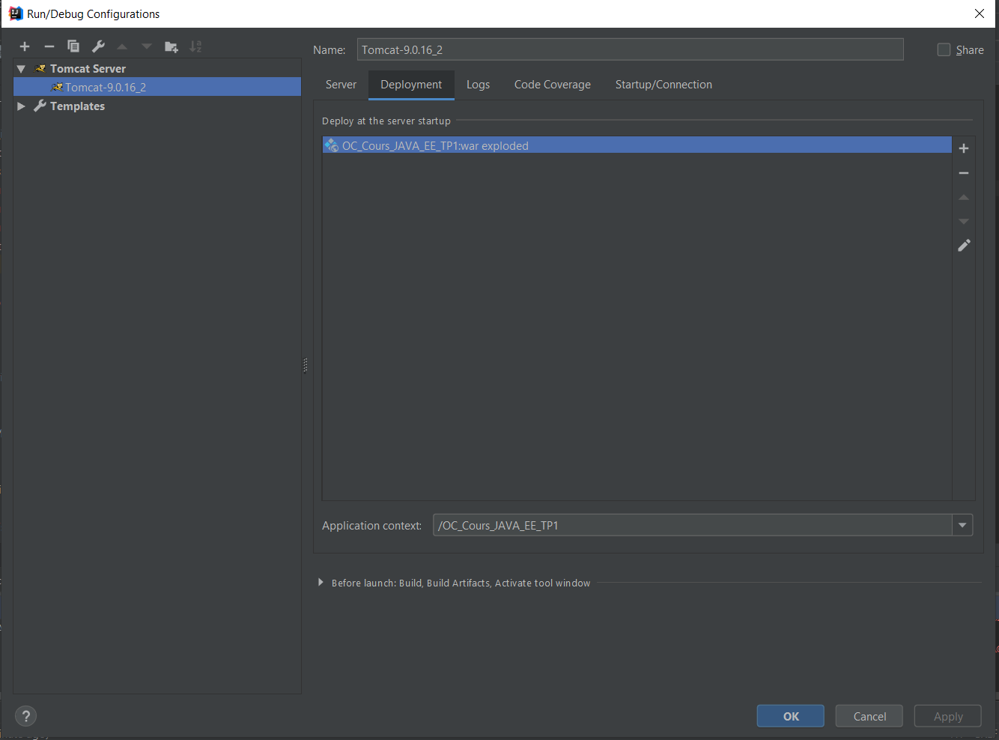

# Configuration

## intelliJ
La configuration est assez basique car nous n'utilisons pas Maven.
Pour plus de détails, se reporter aux copies d'écrans disponibles dans le répertoire doc/configuration_intelliJ.

## Tomcat

La configuration de Tomcat sous IntelliJ : Se reporter aux copies d'écrans ci-dessous :

# Lancement de l'application

Le lancement de l'application sous IntelliJ est réalisé en cliquabt sur la flèche verte à droite de la liste de choix de l'application à lancer.

Le lancement de l'application directement de puis Tomcat nécessite d'avoir démarré Tomcat puis d'avoir déployé le fichier WAR dans le répertoire webapp/ de Tomcat.